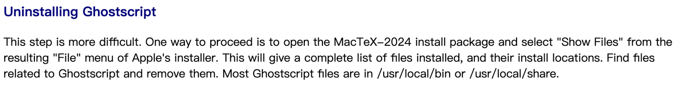

MacTax装起来很容易，但是卸载起来很麻烦。所以这里我们记录一下卸载的步骤，以便后续大家使用。

首先，卸载Mac上的MacTex有个比较头疼的地方，MacTex在安装后会由4部分构成：

- GUI图形化界面（在电脑的 `/Applications/Tex` 文件夹下，卸载难度：无）
- TexLive的发行版（在 `/usr/local/texlive/` 文件夹下，卸载难度： ）
- TexLive发行版的数据结构（在 `/Library/TeX` 文件夹下，卸载难度： ）
- 散落在各个地方的鬼鬼祟祟脚本(GhostScript)和相关文件，这些文件的位置很多，卸载难度

前边都没啥好说的，重点说下鬼鬼祟祟脚本(GhostScript)，以下简称鬼脚本。

鬼脚本的藏身位置很难寻找，所以，官方推荐下载个安装包来帮你找它们的安装位置，然后你再根据位置一个个删除，我真是*…*%&¥&R&…*%&…¥…（（（&……%%¥@##@@@。



就算你照着官方说的做了，官方也真的很能整人，你会发现鬼脚本被弄的到处都是，不少还是敏感位置不能乱碰。

# 卸载前3部分

打开 terminal, 输入指令

```bash
sudo rm -rf /Applications/Tex /usr/local/texlive /Library/Tex
```

这里可能要输入密码，盲输密码后按回车就行，然后就等待漫长的删除，（密码不显示，别以为自己没有输入成功）。

# 卸载鬼鬼祟祟脚本

1. 准备MacTex的安装包，用以查找鬼脚本的位置。可以从官网下载，这是链接[MacTeX - TeX Users Group (tug.org)](https://link.zhihu.com/?target=https%3A//www.tug.org/mactex/mactex-download.html)。历史版本
2. 准备一个卸载用的脚本，非常短，这是脚本内容，有兴趣的可以自己创建也行。

   ```bash
   uninstall_ghostscript () {
       bom_usr_local=$(pkgutil --bom $1 | grep -F Ghostscript)
       lsbom -s -f $bom_usr_local | grep -F -v ghostscript | sed 's_^\.__' | while read filename; do
   
   	if [[ -e $filename ]]; then
   	    command mv - "$filename" ~/.Trash
   	else
   	    echo "$filename is alreday removed."
   	fi
       done
   	if [[ -e "/usr/local/share/ghostscript" ]]; then
           command mv -v /usr/local/share/ghostscript ~/.Trash
   	fi
   }
   
   uninstall_ghostscript $1
   ```

3. 执行脚本删除: `uninstall_ghostscript脚本 + mactex.pkg`

   打开终端，就跟之前一样，然后 再拖动脚本到终端，（相当于输入脚本的地址了）
   最后拖动MacTex到终端（相当于输入了安装包参数的地址）。
   然后按下回车，输入密码，跟刚才一样输入密码不显示。

4. 打开回收站，就可以看到刚刚删除的一些鬼脚本了。这时候就可以一键清空了。另外那个下载的安装包MacTex.dmg也用不到了，删了吧。
